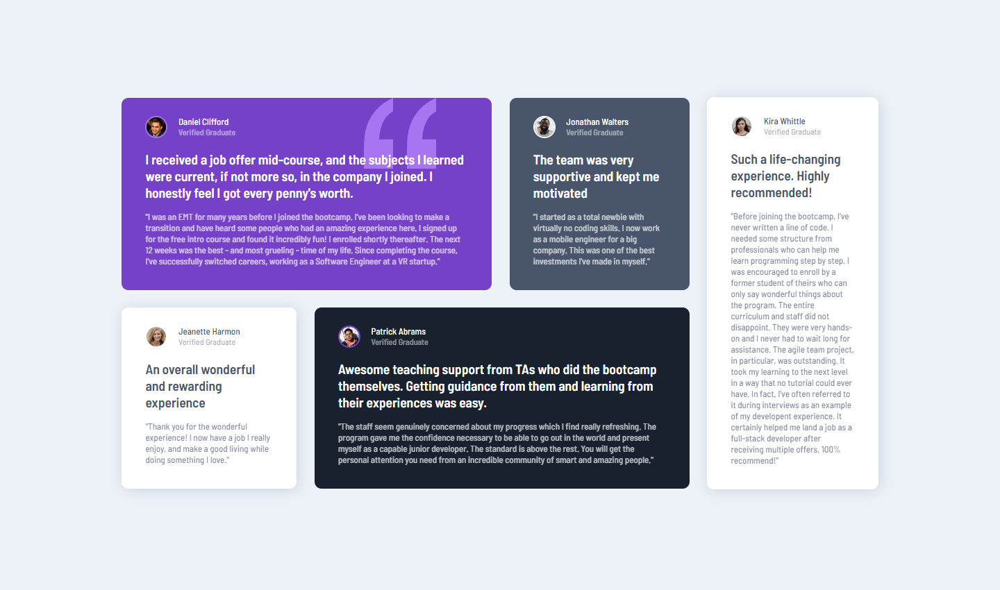

# Frontend Mentor - Testimonials grid section solution

This is a solution to the [Testimonials grid section challenge on Frontend Mentor](https://www.frontendmentor.io/challenges/testimonials-grid-section-Nnw6J7Un7). Frontend Mentor challenges help you improve your coding skills by building realistic projects. 

## Table of contents

- [Overview](#overview)
  - [The challenge](#the-challenge)
  - [Screenshot](#screenshot)
  - [Links](#links)
- [My process](#my-process)
  - [Built with](#built-with)
  - [What I learned](#what-i-learned)
  - [Continued development](#continued-development)
- [Author](#author)

## Overview

### The challenge

Users should be able to:

- View the optimal layout for the site depending on their device's screen size

### Screenshot




### Links

- Solution URL: [testimonials-grid-section-main](https://github.com/thillbilly/testimonials-grid-section-main/)
- Live Site URL: [testimonials-grid-section-main](https://thillbilly.github.io/testimonials-grid-section-main/)

## My process

### Built with

- Semantic HTML5 markup
- CSS Grid
- Mobile-first workflow

### What I learned

As you can see in the screenshot, there is a big quotation beneath the text in first user card. In my view, there is a general way to put that `` element to the specific position by setting position property to absolute and give it a appropriate left or right value. (First of all, big quotation's parent element which is called user card should be assigned as a **relative** element). It was just sitting above the text after applying what I said above like that:


Then I started confused about how to lower the big quotation's showing precedence. It's not special to come up with the idea of  `z-index` , and when I apply it to the big quotation, nothing happened.

```css
#user-card {
	position: relative;
}

#big-quotation {
    position: absolute;
    top: 0;
    right: 15px;
    z-index: -1;   /* it doesn't work*/
}
```

Then I turned to search for other methods to achieve that goal. I tried to change its html structure and its didn't work out. Anyway, I just needed to think about question from the top to bottom. 

Once we apply position property to any other values except normal(by default), the element just jump out of the document flow, then we could use top, right, bottom, left to adjust its position on the screen, z-index also becomes functional in that situation I supposed. 


Now we got two elements outside the document flow, big quotation and user card. For the texts in user card, they were been viewed as a part of user card so positioned bottom along with it. If we could divide it from user card and turn the situation from two elements into three elements by setting position property to each of them, would things be different? We've already gave user card `position: relative` and big quotation `position: absolute`, so just give the text(for me, its a `<p>` element) element `position: inherit` or `position: relative` both could make it out of normal flow, and z - index could work by now.

```css
#user-card {
	position: relative;
}

#big-quotation {
    position: absolute;
    top: 0;
    right: 15px;
    z-index: -1;   /* it doesn't work*/
}

#text {
    position: inherit;
    z-index: 1;
}
```
### Continued development

#### Layout stability

The project I simulated looks pretty well on specific screen size like 375px and 1440px. But when viewport size changes between the two solid options or beyond one of both, things become complicated.


I wonder if the layout like that should be aligned when resize the viewport. If it should act like a alignment square, then how to do it? 

I've tried using percentage and `calc()` as the value of width or height property, but they can't make it aligned through resizing neither. But all in all, I could say I finish the project more or less, just need to pay more attention on the layout resizing related methods on future projects.

#### Animation illustration

I want to make a explanation about how could position property's change effects the document flow. It's a animation combined 2D and 3D and not pretty difficult to think of. But what kind of tool should I use to generate a GIF to express that thought. I believe HTML + CSS + JavaScript could finish it, but I never encounter with WebGL before, so I really don't know how to start it. Then I turned to my *Athena Exclamation: After Effects* to do it. But I think the more frontend knowledge I learn, the more effects I could make.

## Author

- Website - [thillbilly](https://github.com/thillbilly)
- Frontend Mentor - [@thillbilly](https://www.frontendmentor.io/profile/thillbilly)
